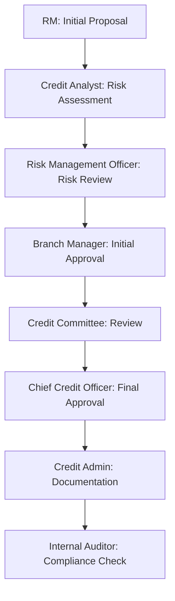

# Nepalese Banking System - Role-Based Access Control (RBAC)

## Project Overview
This project implements a sophisticated Role-Based Access Control (RBAC) system specifically designed for Nepalese banking institutions. The system provides a secure, flexible, and compliant way to manage user permissions and access controls within the banking environment.

## Business Context
In the Nepalese banking sector, different roles require different levels of access and authorization. The system is designed to handle:
- Loan processing workflows
- Branch-specific operations
- Credit management
- Risk assessment
- Audit requirements
- Working hour restrictions (Nepal timezone)

## Core Features

### 1. Role Management
- **Hierarchical Roles**: Nine predefined roles with specific responsibilities:
  - Relationship Manager (loan proposals up to 5M NPR)
  - Loan Officer (processing up to 1M NPR)
  - Branch Manager (approvals up to 10M NPR)
  - Credit Committee Member (approvals up to 50M NPR)
  - Credit Administration Officer (documentation and disbursement)
  - Internal Auditor (audit access)
  - Chief Credit Officer (approvals up to 100M NPR)
  - Risk Management Officer (risk assessment)
  - Credit Analyst (credit analysis)

### 2. Permission Controls
- **Granular Permissions**: Fine-grained control over system actions
- **Amount-based Limits**: Transaction and approval limits based on role
- **Branch Restrictions**: Three levels of branch access:
  - OWN_BRANCH_ONLY
  - OWN_BRANCH_AND_SUBORDINATES
  - ALL_BRANCHES

### 3. Time-Based Access
- **Working Hours**: Sunday-Friday, 9 AM-5 PM (Nepal time)
- **Flexible Configuration**: Customizable per role
- **Holiday Management**: Support for Nepalese banking holidays

### 4. Validation Framework
The system implements a robust validation framework using:
- Template Method Pattern for structured validation
- Abstract Factory Pattern for validator creation
- Comprehensive validation rules for:
  - Role names and descriptions
  - Permission assignments
  - Working hour configurations
  - Branch access restrictions
  - Amount limits

## Technical Implementation

### Architecture
- **Spring Boot Backend**: Java-based REST API
- **MongoDB Database**: Document storage for flexible schema
- **Validation Framework**: Custom implementation using design patterns

### Key Components

#### 1. Data Transfer Objects (DTOs)
- `RoleDefinition`: Core role information
- `RoleConfiguration`: Role-specific settings
  - Working hours
  - Branch restrictions
  - Amount limits
  - Audit features
  - Risk assessment capabilities

#### 2. Validation Framework
```java
public abstract class AbstractValidator<T> {
    public final void validate(T request) {
        preValidate(request);
        doValidate(request);
        postValidate(request);
    }
}
```

#### 3. Role Validator Implementation
- Comprehensive validation for:
  - Role naming conventions (uppercase with underscores)
  - Description requirements (10-200 characters)
  - Permission existence validation
  - Time format validation (HH:mm)
  - Working days validation
  - Branch restriction types
  - Amount limit validation

## Current Progress

### Completed Features
1. **Core Framework Setup**
   - Spring Boot application structure
   - MongoDB integration
   - Basic security configuration

2. **Role Management**
   - Role definition structure
   - Permission management
   - Configuration templates

3. **Validation Framework**
   - Abstract validator implementation
   - Role creation validator
   - Custom validation exception handling

### In Progress
1. **API Development**
   - Role creation endpoints
   - Permission management endpoints
   - Role assignment endpoints

2. **Additional Features**
   - Holiday calendar integration
   - Audit logging
   - Branch hierarchy management

## Next Steps

### Planned Features
1. **Enhanced Security**
   - JWT authentication
   - Session management
   - Activity logging

2. **Business Logic**
   - Approval workflows
   - Transaction processing
   - Report generation

3. **Integration**
   - Core banking system integration
   - Audit system integration
   - Compliance reporting

## Technical Requirements

### Prerequisites
- Java 17
- Spring Boot 3.4.6
- MongoDB
- Maven

### Dependencies
```xml
<dependencies>
    <dependency>
        <groupId>org.springframework.boot</groupId>
        <artifactId>spring-boot-starter-data-mongodb</artifactId>
    </dependency>
    <dependency>
        <groupId>org.springframework.boot</groupId>
        <artifactId>spring-boot-starter-validation</artifactId>
    </dependency>
    <!-- Additional dependencies -->
</dependencies>
```

## Best Practices Implemented
1. **SOLID Principles**
   - Single Responsibility Principle in validators
   - Open/Closed Principle in validation framework
   - Interface Segregation in role definitions
   - Dependency Inversion in service layer

2. **Design Patterns**
   - Template Method Pattern for validation
   - Factory Pattern for validator creation
   - Repository Pattern for data access
   - Builder Pattern for complex objects

3. **Security Best Practices**
   - Input validation
   - Role-based access control
   - Secure password handling
   - Audit logging

## Contributing
Guidelines for contributing to the project, including:
- Code style
- Pull request process
- Testing requirements
- Documentation standards

## License
[Specify License]

## Complex Role and Permission Scenarios

### 1. Loan Processing Workflow
#### Scenario: Corporate Loan Application (Above 50M NPR)


**Role Interactions**:
- Relationship Manager (RM):
  - Can create proposals up to 5M NPR independently
  - Must route larger proposals through approval chain
  - Can view status but cannot modify after submission

- Credit Analyst:
  - Access to customer financial data
  - Can request additional documents
  - Cannot see other branches' analyses unless explicitly shared

- Branch Manager:
  - Can approve up to 10M NPR
  - Can delegate approval authority during leave
  - Must document reason for rejection

#### Permission Inheritance Rules:
```
Chief Credit Officer
└── Credit Committee Member
    └── Branch Manager
        └── Relationship Manager
            └── Loan Officer
```

### 2. Time-Sensitive Operations

#### Working Hours Enforcement
- **Regular Hours**: Sun-Fri, 9 AM-5 PM NPT
- **Extended Access**:
  - Branch Manager: 8 AM-6 PM
  - IT Support: 24/7 access
  - System Maintenance: Sat 9 AM-1 PM

#### Emergency Protocols
- **System Override Capabilities**:
  1. Branch Manager: Up to 1 hour extension
  2. Regional Manager: Up to 3 hours
  3. Chief Officer: Unlimited with audit log

### 3. Branch Access Matrix

| Role                    | Own Branch | Subordinate Branches | All Branches | After Hours |
|------------------------|------------|---------------------|--------------|-------------|
| Loan Officer           | Full       | View Only           | No Access    | No         |
| Branch Manager         | Full       | Limited Approve     | View Only    | Emergency   |
| Credit Committee       | Full       | Full                | Full         | Limited     |
| Internal Auditor       | Full       | Full                | Full         | Yes         |

### 4. Amount-Based Restrictions

#### Transaction Limits
```
Loan Processing Limits (NPR):
└── Chief Credit Officer (100M)
    └── Credit Committee (50M)
        └── Branch Manager (10M)
            └── Relationship Manager (5M)
                └── Loan Officer (1M)
```

#### Override Mechanisms
1. **Temporary Limit Increase**:
   - Requires dual authorization
   - Valid for specific transaction only
   - Must be pre-approved by superior role

2. **Emergency Authorization**:
   - Available during system outages
   - Requires physical documentation
   - Must be ratified within 24 hours

### 5. Special Access Scenarios

#### 1. Audit Mode
- Internal Auditor gains:
  - Read access to all transactions
  - View of deleted records
  - Access to change history
  - System configuration logs

#### 2. Investigation Mode
- Triggered by:
  - Suspicious transaction flags
  - Compliance violations
  - Customer complaints
- Special permissions:
  - Transaction trace capability
  - Document version history
  - Communication logs
  - Override history

### 6. Compliance and Regulatory Requirements

#### Role-Based Reports
Each role must generate specific reports:
- **Branch Manager**:
  - Daily transaction summary
  - Staff performance metrics
  - Risk exposure reports

- **Credit Committee**:
  - Portfolio quality reports
  - Concentration risk analysis
  - Approval rate statistics

- **Internal Auditor**:
  - Compliance violation reports
  - Access pattern analysis
  - Override usage reports

#### Regulatory Checks
- **Four-Eye Principle**:
  - Large transactions require dual approval
  - System configuration changes need verification
  - User role modifications need secondary approval

### 7. Dynamic Permission Adjustments

#### Temporary Role Elevation
- **Acting Positions**:
  - Maximum duration: 30 days
  - Requires documentation
  - Maintains audit trail

- **Emergency Access**:
  - Limited to 4 hours
  - Requires incident report
  - Automatic reversion

#### Role Conflicts
- **Separation of Duties**:
  - Maker-Checker rules
  - Cannot approve own transactions
  - Cannot audit own department

### 8. Integration Scenarios

#### External System Access
- **Core Banking System**:
  - Read/Write permissions based on role
  - Transaction initiation rights
  - Report generation capabilities

- **Credit Bureau Integration**:
  - Credit report access levels
  - Score modification rights
  - History viewing permissions

#### API Access Control
- **Internal APIs**:
  - Role-based rate limiting
  - Data field level permissions
  - Encryption key access

- **External APIs**:
  - Partner system integration
  - Third-party service access
  - Data sharing restrictions 